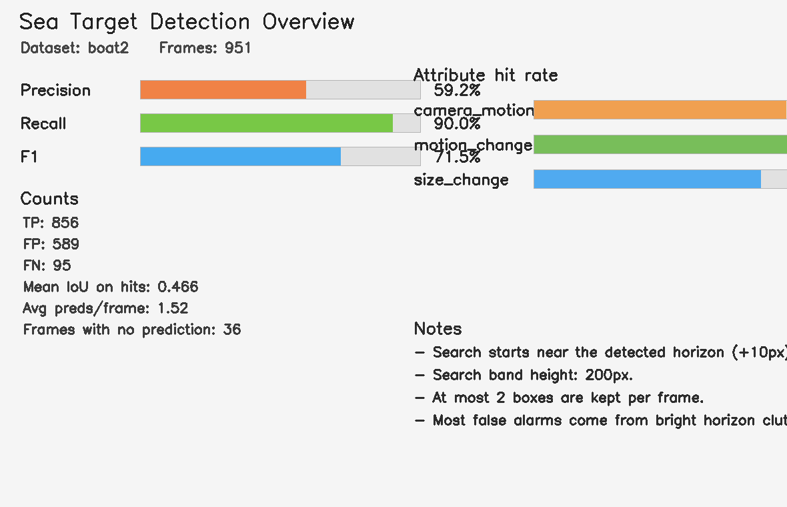
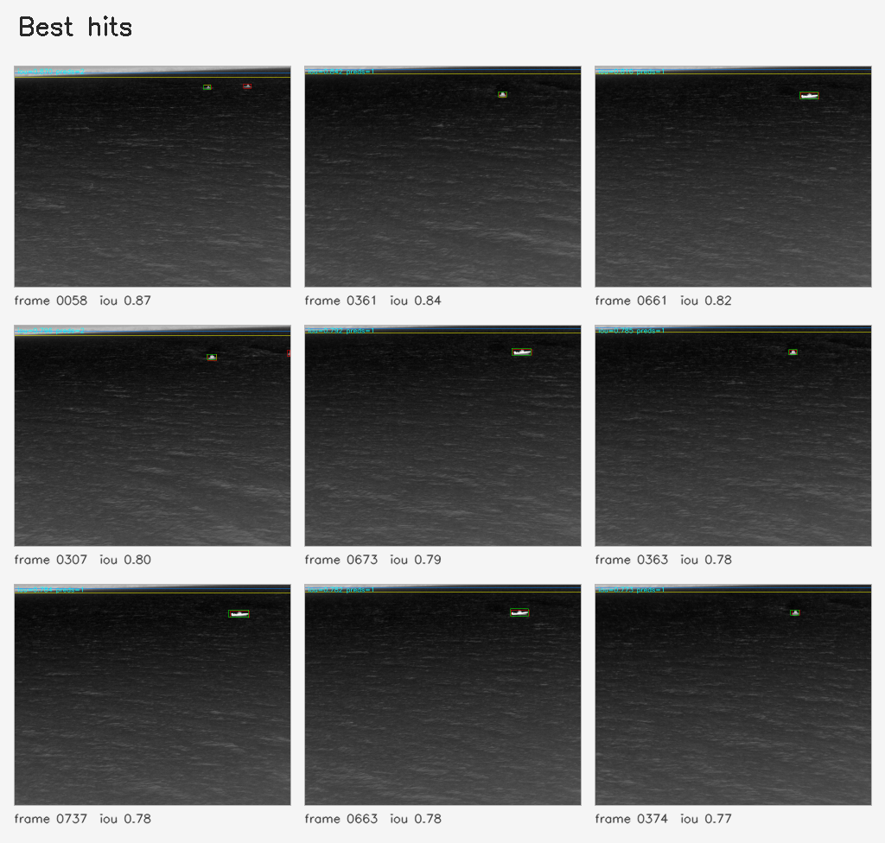
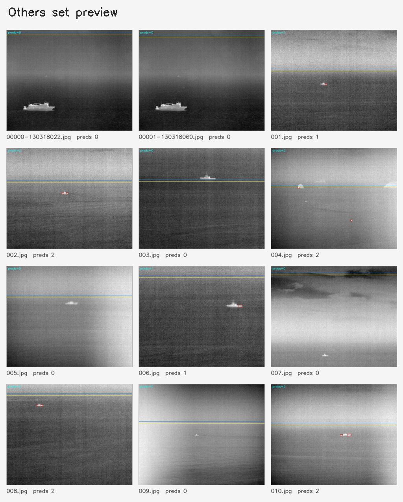
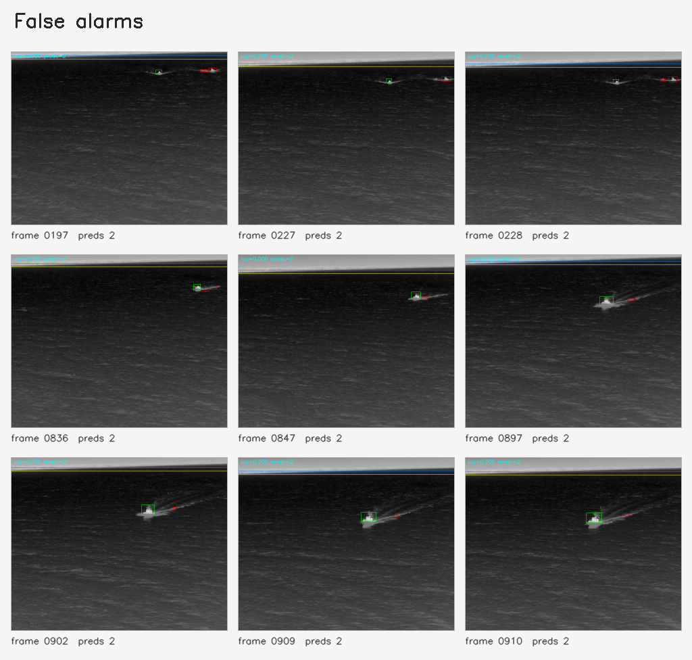
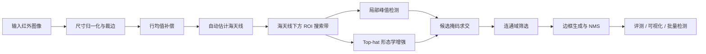

# Infrared-Target-Detector

基于海天线先验、局部峰值检测与形态学增强的海面红外弱小目标检测项目。仓库提供完整的 Python 检测、评测与可视化流程，同时保留了早期 MATLAB / Python 原型，方便课程设计、算法复现和后续改进。

## 项目亮点

- 传统方法路线，不依赖模型训练，开箱即可运行。
- 自动估计海天线，把搜索区域约束在目标更可能出现的海面带状区域。
- 结合局部峰值和 Top-hat 增强，适合突出暗背景中的高亮弱小目标。
- 支持有标注数据评测、无标注图像批量检测、随机抽样演示三种使用方式。
- 自动输出总览图、命中样例、误检样例和逐帧可视化结果，适合直接写报告或上传 GitHub。

## 效果预览

以下结果来自当前默认参数在本地 `data/raw/boat2` 上的有标注评测，以及其他本地无标注目录上的批量检测运行。出于数据来源和体积考虑，本仓库不上传原始 `data/` 目录。

| 数据集 | 帧数 | IoU 阈值 | Precision | Recall | F1 | TP | FP | FN |
| --- | ---: | ---: | ---: | ---: | ---: | ---: | ---: | ---: |
| `boat2` | 951 | 0.1 | 0.5924 | 0.9001 | 0.7145 | 856 | 589 | 95 |





<details>
<summary>展开查看更多结果图</summary>





</details>

结果图说明：

- 红框表示预测框。
- 绿框表示真值框。
- 蓝线表示估计到的海天线位置。
- 黄线表示实际开始搜索的 ROI 起始线。

## 方法概览



核心流程可以概括为：

1. 将输入图像转为灰度图，并统一到 `640 x 512` 分辨率。
2. 对图像做行均值补偿，减弱海面整体亮度梯度造成的影响。
3. 基于行平均灰度变化自动搜索海天线。
4. 在海天线下方偏移一小段距离后，仅对有限高度的海面带状区域做目标搜索。
5. 分别通过局部极大值和 Top-hat 形态学增强提取高亮候选区域。
6. 对候选区域做连通域过滤，按面积、宽高、长宽比和局部对比度筛掉大量噪声。
7. 将候选掩码转成边框后再做 NMS，输出最终检测结果。

## 仓库结构

```text
Infrared-Target-Detector/
├── README.md
├── requirements.txt
├── requirements-cn.txt
├── run_project.py          # 自动遍历数据目录；有标注则评测，无标注则批量检测
├── detect_others.py        # 对无标注图片批量检测
├── sample_and_detect.py    # 随机抽样并生成检测结果
├── sea_detector.py         # 核心检测器实现
├── evaluate.py             # 评测、指标统计与结果可视化
├── dataset_io.py           # 数据集和标签读取
├── image_io.py             # 兼容中文路径的读写工具
├── report_utils.py         # 联系图/总览图生成
├── data/                   # 本地数据目录，需自行准备，不随仓库上传
│   ├── raw/                # 原始数据放置位置
│   └── sampled/            # 抽样脚本生成的数据
├── outputs/                # 默认输出目录
├── docs/
│   └── images/             # README 展示图
└── legacy/
    ├── matlab/             # 早期 MATLAB 原型
    └── python/             # 早期 Python 原型
```

## 环境安装

推荐 Python 3.10 及以上版本。

```bash
pip install -r requirements.txt
```

如果你在国内网络环境下安装依赖：

```bash
pip install -r requirements-cn.txt
```

当前项目依赖非常轻量，核心只需要：

- `numpy`
- `opencv-python`

## 快速开始

### 0. 准备本地数据

仓库默认从 `data/raw` 读取数据，但 GitHub 版本不包含原始数据。请在本地按如下结构放置数据：

```text
data/raw/
├── boat2/                  # 有标注数据，需包含 groundtruth.txt
├── data1/                  # 可选：无标注附加图像
├── others/                 # 可选：无标注测试图像
├── 多样性数据/              # 可选：无标注多样场景图像
└── 海天线上的目标/           # 可选：无标注海天线附近目标图像
```

如果只想验证有标注评测，至少准备 `data/raw/boat2`。

#### 数据集来源与版权说明

本项目使用的 `boat2` 序列可从 VOT 官方公开数据集 VOT-TIR2016 获取。为避免数据版权和二次分发风险，本仓库不上传任何原始图像、标注压缩包或老师提供的整理版数据，只保留代码和结果展示图。

官方入口：

- VOT2016 数据集说明页：<https://www.votchallenge.net/vot2016/dataset.html>
- VOT-TIR2016 数据集描述文件：<https://data.votchallenge.net/vot2016/tir/description.json>
- `boat2` 标注包：<https://data.votchallenge.net/vot2016/tir/boat2.zip>
- `boat2` 红外图像序列包：<https://data.votchallenge.net/sequences/6eaa8958bd2ef6cd761dc578399d8667783c4955229bb602011986de6844dbc175f27612200b49ab0f9cf3745ad35e11cf140d167d2f09e48a5421807795774f.zip>
- `boat2` 预览图：<https://data.votchallenge.net/vot2016/tir/boat2.png>
- `boat2` 预览动图：<https://data.votchallenge.net/vot2016/tir/boat2.gif>

复现时可以从上述官方链接下载图像序列和标注文件，解压后放到 `data/raw/boat2`。官方属性文件后缀为 `.tag`，本项目本地整理版使用 `.label`；如果需要统计属性标签，可以将对应文件按下面的格式说明重命名。

### 1. 一次性运行全部数据目录

```bash
python run_project.py
```

默认等价于：

```bash
python run_project.py --dataset data/raw --output outputs/runs/all_datasets --iou 0.1
```

运行逻辑：

- 如果子目录包含 `groundtruth.txt`，程序会执行完整评测并输出 Precision、Recall、F1 等指标。
- 如果子目录没有标注文件，程序会执行批量检测并输出每张图的检测结果和预览图。
- 当前 `data/raw` 下会自动处理 `boat2`、`data1`、`others`、`多样性数据`、`海天线上的目标`。

运行完成后，典型输出包括：

- `all_datasets_summary.md`：全部数据集运行汇总
- `boat2/summary.md`、`boat2/overview.png`：有标注数据集的评测结果
- `data1/preview.png`、`others/preview.png` 等：无标注数据集的检测预览
- 各子目录下的 `result_*.png` 或 `visualizations/`：逐帧可视化结果

如果只想运行单个数据集，可以指定具体文件夹：

```bash
python run_project.py --dataset data/raw/boat2 --output outputs/runs/boat2_only
python run_project.py --dataset data/raw/others --output outputs/runs/others_only
```

### 2. 对无标注图像批量检测

```bash
python detect_others.py
```

默认输入输出路径：

- 输入目录：`data/raw/others`
- 输出目录：`outputs/detect/others_results`

运行后会得到：

- 每张图的检测结果图
- `preview.png`：多图预览联系图
- `summary.md`：批量检测摘要

### 3. 随机抽样并生成演示结果

```bash
python sample_and_detect.py
```

默认会从以下目录中随机抽样：

- `data/raw/others`
- `data/raw/boat2`
- `data/raw/data1`

默认抽取 `60` 张图片，并将结果写入：

- 采样数据：`data/sampled/dataset`
- 检测结果：`outputs/detect/sampled_results`

## 常用参数

下面这些参数是调试检测效果时最常用的：

| 参数 | 默认值 | 说明 |
| --- | ---: | --- |
| `--iou` | `0.1` | 评测时判定 TP 的 IoU 阈值 |
| `--roi-start-y` | `40` | 固定 ROI 起始行（关闭自动海天线时生效） |
| `--peak-kernel` | `19` | 局部峰值检测核大小 |
| `--l-factor` | `2.1` | 峰值阈值系数，越大越保守 |
| `--min-area` | `6` | 最小连通域面积 |
| `--max-area` | `800` | 最大连通域面积 |
| `--horizon-band-height` | `200` | 海天线下方搜索带高度 |
| `--horizon-offset` | `10` | 海天线向下偏移量 |
| `--max-boxes` | `2` | 每帧最多保留的检测框数 |
| `--disable-auto-horizon` | 关闭 | 使用固定 ROI，而不是自动搜索海天线 |

示例：增大搜索带高度并关闭自动海天线。

```bash
python run_project.py --horizon-band-height 260 --disable-auto-horizon --roi-start-y 50
```

## 数据格式说明

默认评测集 `data/raw/boat2` 采用如下组织方式：

```text
boat2/
├── 00000001.png
├── 00000002.png
├── ...
├── groundtruth.txt
├── camera_motion.label
├── motion_change.label
├── size_change.label
├── occlusion.label
└── dynamics_change.label
```

其中：

- `groundtruth.txt` 每一行对应一帧目标标注。
- 每行由 8 个数字构成，表示目标四边形的四个顶点坐标。
- 评测代码会自动把四边形转换成外接矩形框用于 IoU 计算。
- `*.label` 文件是按帧存储的二值属性标签，可用于统计不同场景属性下的命中率；VOT 官方下载包中这些文件通常以 `.tag` 为后缀，可按名称对应重命名为 `.label`。

## 当前实现的优点与局限

优点：

- 不需要训练数据和 GPU，适合作为传统方法 baseline。
- 算法结构清晰，可解释性强，便于调参数和写实验报告。
- 已经集成评测、联系图和可视化输出，复现实验比较方便。

局限：

- 亮海天线、尾迹、高亮杂波仍然容易带来误检。
- 当前方法更适合单目标或极少量目标场景，默认每帧最多保留 2 个检测框。
- 规则式方法对不同海况和成像条件的泛化能力有限，参数需要结合数据集调整。

## 后续改进建议

- 引入时序信息，利用相邻帧增强真实目标、抑制瞬时噪声。
- 增加多尺度滤波或局部背景建模，提高对不同尺寸目标的适应性。
- 将当前传统方法作为候选生成器，再叠加轻量分类器做二次判别。
- 系统整理 `legacy/` 中的历史代码，与当前版本做更正式的消融对比。

## 致谢与说明

- 本仓库当前以 Python 版本为主线，`legacy/` 中保留了早期原型代码。
- README 中展示图已整理到 `docs/images/`，上传到 GitHub 后可直接显示。
- 如果你希望把它进一步整理成论文风格仓库，还可以继续补充 `LICENSE`、实验表格和引用信息。
